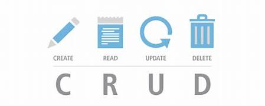
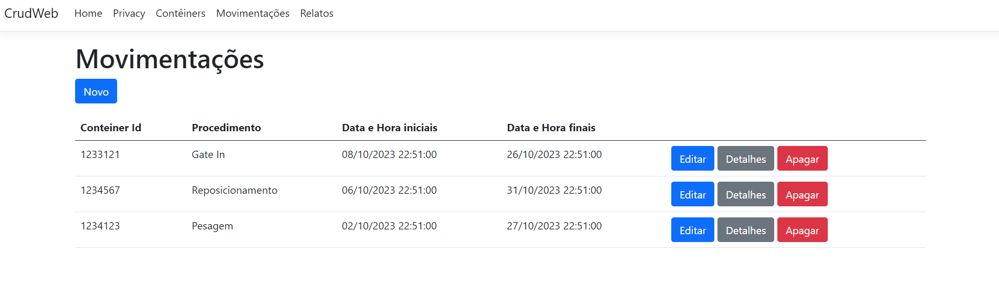

<h1 align="center">
    
    Projeto CRUD - Gerenciando Contêineres com C# e MySql🚢🚢
</h1>
 
---------------------------------------------------------------
<h1 align="center">
    
</h1>

<h1 align="center">
    
</h1>

---

## 🚀Sobre o Projeto:

 💻**Projeto de Um Programador**: Este é o meu projeto CRUD para gerenciar contêineres e movimentações. É uma jornada pessoal na programação e na busca constante de aprimoramento.

 ## 🧑‍💻Linguagens e Tecnologias Utilizadas:

📚 **C#**: A linguagem central deste projeto.

💽 **MySQL**: O banco de dados que armazena os dados.

🏗️ **Entity Framework**: Para interagir com o banco de dados.

🎨 **Bootstrap 5**: Para dar uma aparência mais profissional à interface.

## 🔧Como Utilizar:

🛠️ **Clonar e Rodar:** Basta clonar o repositório, configurar seu ambiente e executar o projeto no Visual Studio Community.

📝 Cadastro de Contêineres: Registre e gerencie contêineres facilmente.

🏗️ **Movimentações Simples:** Acompanhe as movimentações dos contêineres de forma direta.

📊 **Relatórios Básicos:** Crie relatórios simples a partir dos dados disponíveis.

## Objetivo:

🎯 **Aprimoramento Constante:** Como um desenvolvedor individual, estou sempre buscando aprimorar minhas habilidades e meu projeto. Este é apenas o começo da jornada, e há muito espaço para melhorias. Se você tiver sugestões ou quiser contribuir, fique à vontade para fazer parte deste projeto em constante evolução.
Lembre-se, a jornada de um programador é repleta de aprendizado contínuo. Boa sorte com seu projeto no GitHub e continue aprimorando suas habilidades!

